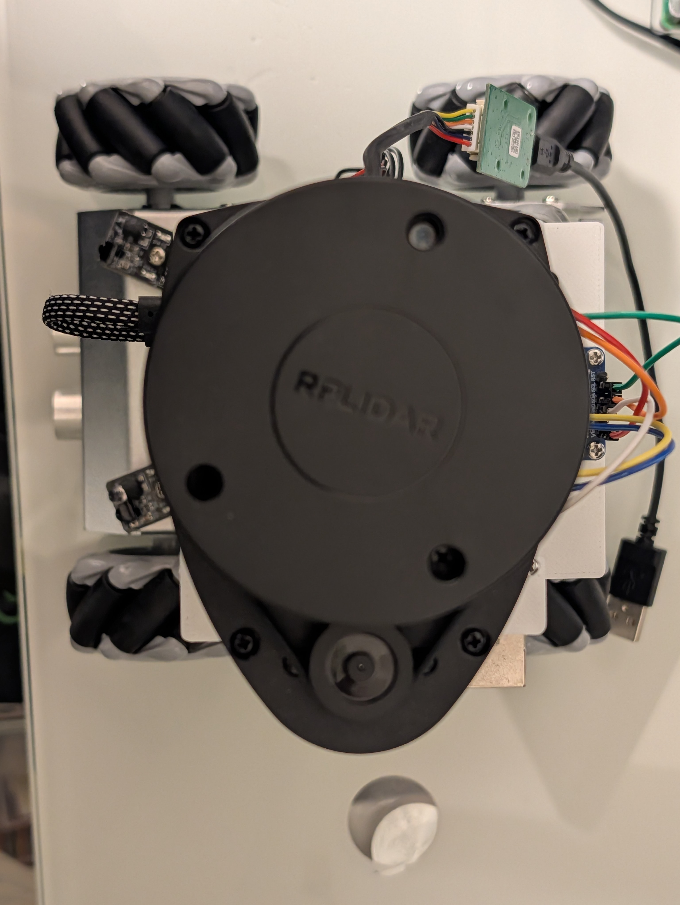

# IR-001: EPIC-003 TF/URDF設計に必要な情報

## 概要

EPIC-003（TF/URDF設計）を進めるにあたり、実機の寸法情報およびLiDAR取り付け位置の情報が必要です。

---

## ステータス

- **作成日**: 2026-01-12
- **最終更新**: 2026-01-18
- **ステータス**: 情報収集中（本体寸法: 部分完了）
- **関連バックログ**: EPIC-003, STORY-006, STORY-007, STORY-008

---

## 必要な情報一覧

### 1. ロボット本体の寸法

| 項目 | 説明 | 値（mm） | 備考 |
|---|---|---|---|
| 全長 (Length) | ロボット前後方向の長さ | **163** | X軸方向 |
| 全幅 (Width) | ロボット左右方向の幅 | **177** | Y軸方向 |
| 全高 (Height) | 地面からロボット最上部までの高さ | ? | Z軸方向 |
| ベース高さ | 地面からロボットベース板までの高さ | ? | base_link Z位置 |

### 2. メカナムホイール構成

| 項目 | 説明 | 値（mm） | 備考 |
|---|---|---|---|
| ホイール半径 | メカナムホイールの半径 | ? | |
| トレッド幅 | 左右ホイール中心間距離 | ? | Y軸方向 |
| ホイールベース | 前後ホイール中心間距離 | ? | X軸方向 |
| ホイール中心高さ | 地面からホイール中心までの高さ | ? | =ホイール半径 |

### 3. LiDAR取り付け位置（重要）

LiDARの取り付け位置は、laser_frameの定義に直結します。

| 項目 | 説明 | 値（mm） | 備考 |
|---|---|---|---|
| X位置 | ロボット中心からの前後オフセット | ? | 前方が正 |
| Y位置 | ロボット中心からの左右オフセット | ? | 左が正 |
| Z位置 | 地面からLiDARスキャン面までの高さ | ? | |
| Yaw角度 | 水平面での回転角度 | ? | 前方=0度、反時計回りが正 |

#### 参考図

```
        前方 (+X)
           ↑
     +-----|-----+
     |     |     |
     |  [LiDAR]  |    ← LiDARの取り付け位置を確認
左(+Y)←----+----→右(-Y)
     |     |     |
     |   [ロボット] |
     +-----|-----+
           ↓
        後方 (-X)
```

### 4. 座標系の確認

ROS 2標準（REP-103）に準拠：
- **X軸**: 前方が正
- **Y軸**: 左方が正
- **Z軸**: 上方が正

### 5. 追加情報（あれば望ましい）

- [ ] ZeusCar製品ページ/マニュアルのURL
- [ ] 実機の写真（LiDAR取り付け状態）
- [ ] CADデータや寸法図

---

## TFツリー設計（予定）

```
map
 └── odom                    ← SLAM/オドメトリが提供
      └── base_footprint     ← 地面に投影されたロボット位置
           └── base_link     ← ロボット本体の中心
                └── laser_frame  ← LiDARスキャン面
```

### 各フレームの定義

| 親フレーム | 子フレーム | 変換タイプ | 説明 |
|---|---|---|---|
| map | odom | 動的 | SLAMが補正 |
| odom | base_footprint | 動的 | オドメトリ |
| base_footprint | base_link | 静的 | Z方向のオフセット |
| base_link | laser_frame | 静的 | LiDAR取り付け位置 |

---

## 回答方法

以下のいずれかの方法で情報をご提供ください：

1. 本ドキュメントの「?」部分を直接編集
2. チャットで寸法値を伝達
3. 写真・図面を共有（寸法がわかるもの）

---

## RPLIDAR A1M8 向き・座標系（調査結果）

### 1. 前方向（0度）の定義

| 部位 | 向き |
|------|------|
| **テーパー状の端（先細りの端）** | 前方（0度） |
| **USBケーブル接続側** | 後方 |
| **モーター搭載側** | 前方（テーパー側と同じ） |

### 2. スキャン方向

- **時計回り（Clockwise）** にスキャン
- 最初のレンジデータは前方（テーパー側）から開始

### 3. ROS座標系への変換

rplidar_rosドライバは内部で左手系→右手系に変換済みです。

### 4. 実際の取り付けパターン

```
パターンA: TF変換なしで使う場合
┌─────────────────┐
│    [テーパー端]   │  ← 前方（ロボット進行方向）
│                  │
│    RPLIDAR A1    │
│                  │
│  [USBケーブル側]  │  ← 後方
└─────────────────┘

パターンB: 逆向きに取り付けた場合
→ TFで180度回転させるか、`inverted`パラメータを使用
```

### 5. 主要パラメータ（rplidar_ros）

| パラメータ | 用途 |
|-----------|------|
| `inverted` | LiDARを上下逆に取り付けた場合 |
| `flip_x_axis` | X軸反転（モーターが後ろ向きの場合） |
| `angle_compensate` | 角度補正 |

### 6. 推奨アプローチ

公式データシートに明確な図がないため：
1. **実機でRViz確認**: LiDARを起動し、手を前方にかざして/scanが正しく表示されるか確認
2. **TFで補正**: ずれていればlaserフレームのyaw角を調整

### 7. 参考情報源

- [GitHub Issue #77: What is the correct orientation of RPLidar?](https://github.com/robopeak/rplidar_ros/issues/77)
- [GitHub Issue #7: Is rplidar A1 possible to change direction?](https://github.com/Slamtec/rplidar_ros/issues/7)
- [SLAMTEC RPLIDAR A1 公式ページ](https://www.slamtec.com/en/lidar/a1)
- [SLAMTEC RPLIDAR A1 Spec](https://www.slamtec.com/en/lidar/a1spec)
- [Slamtec rplidar_ros GitHub](https://github.com/Slamtec/rplidar_ros)
- [ArduPilot RPLidar Documentation](https://ardupilot.org/copter/docs/common-rplidar-a2.html)

---

## 実機写真からの観察結果

### 参照画像



*画像: ロボットを真上から撮影。画像下方向がロボット前方（+X）*

### 画像から確認できた構成

| 項目 | 観察結果 |
|------|----------|
| シャーシ | アルミ製、4輪メカナムホイール |
| LiDAR | SLAMTEC RPLIDAR A1M8（黒い円盤状） |
| 前方センサー | 2つの赤外線センサー（画像下部中央） |
| 制御基板 | 緑色基板（画像左側、モータードライバー関連） |
| 配線 | カラフルなジャンパーワイヤ（I2C/シリアル用） |

### LiDAR取り付け位置（画像＋設計情報）

| 項目 | 値 | TF設計への影響 |
|------|----------|----------------|
| X位置（前後） | ロボット中心より**後方**に設置 | X値は**負の値** |
| Y位置（左右） | 中心線から**わずかに左**にオフセット | Y値は**正の小さな値** |
| 向き（Yaw） | **+90度（左方向に90度回転）** | Yaw = **+π/2 rad** |

### LiDAR向きの詳細（設計値）

フレームの設計として、LiDARはロボット正面から見て**左方向にジャスト90度回転**（反時計回り）した位置に取り付けられています。

**イメージ**: ロボットと同じ方向を向いて立った場合、体は前を向いているが首だけ左90度を向いた状態。

#### ZeusCar LiDAR配置図

```
              前方 (+X)
                 ↑
                 |
        +--------|--------+
        |        |        |
        |   ←[LiDAR]      |    ← LiDAR前方（テーパー端）は左（+Y）を向いている
        |        |        |
  左(+Y)←--------+--------→ 右(-Y)
        |        |        |
        |        |        |
        +--------|--------+
                 |
                 ↓
              後方 (-X)
```

**凡例**:
- `←[LiDAR]` : LiDAR本体。矢印（←）がLiDARの前方（テーパー端）の向き
- `+` : ロボット中心（base_link原点）

### TF変換パラメータ（laser_frame）

| パラメータ | 値 | 単位 |
|------------|-----|------|
| x | 要実測（負の値） | m |
| y | 要実測（正の小さな値） | m |
| z | 要実測 | m |
| roll | 0 | rad |
| pitch | 0 | rad |
| **yaw** | **+1.5708** (+π/2) | rad |

### 次のアクション

- [x] ~~正確なYaw角オフセットを測定してTFに反映~~ → **+90度（+π/2 rad）確定**
- [ ] 実測による寸法値の取得（メジャーで測定）
  - [ ] X位置: ロボット中心からLiDAR中心までの前後距離
  - [ ] Y位置: ロボット中心からLiDAR中心までの左右距離
  - [ ] Z位置: 地面からLiDARスキャン面までの高さ
- [ ] 実機でLiDARを起動し、/scanデータをRVizで確認（TF設定の検証）

---

## 更新履歴

| 日付 | 内容 |
|---|---|
| 2026-01-12 | 初版作成 |
| 2026-01-13 | RPLIDAR A1M8の向き・座標系調査結果を追加 |
| 2026-01-13 | 実機写真（PXL_20260113_121412405.jpg）からの観察結果を追加 |
| 2026-01-13 | LiDAR Yaw角を確定: +90度（設計値として左方向に90度回転） |
| 2026-01-18 | ロボット本体寸法を実測値で更新: 全長163mm、全幅177mm |
